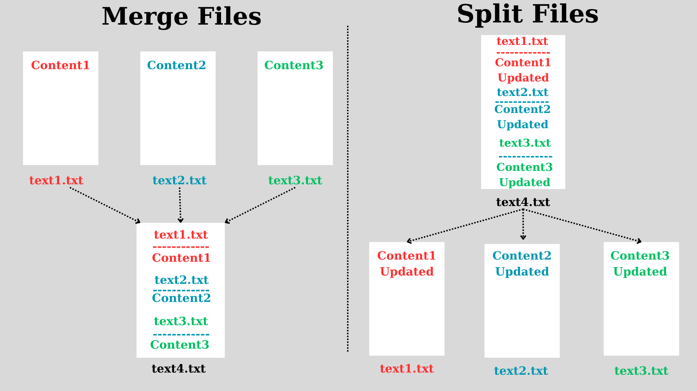

# FileMergerSplitter

Summary:

This project aims to develop a simple file splitting and merging application using the Python programming language. Created with the PyQt5 library, this application is designed to meet user's needs for splitting or merging text files. The methodology of the project focuses on designing a graphical user interface with PyQt5 and utilizing file processing functions.

Keywords: Python, PyQt5, file processing, file splitting, file merging, PyInstaller, graphical user interface.

1. Introduction

File splitter and merger applications are handy tools for processing or sharing large files. These applications typically aim to simplify file operations by providing a user-friendly interface. This study discusses the development of a file splitter and merger application using the Python programming language and the PyQt5 library.

2. Application Design

The application is designed with a graphical user interface using the PyQt5 library. The main window contains two buttons for merging and splitting files. After selecting the files, the user can perform the desired operation and view the result on the screen.

3. File Processing Functions

File splitting and merging operations are carried out using PyQt5's file dialogs (QFileDialog) and Python's file processing capabilities. The selected files are split or merged according to the specified operation, and the result is communicated to the user.

4. Application Usage

The application can be launched from the command prompt or by running FileMergerSplitter.exe in the project's main directory. Users can select their files via the graphical interface and perform the desired operation. The result of file splitting and merging operations is communicated to the user, and processed files can be saved as needed.

5. Conclusion and Future Work

This study demonstrates how a simple file splitter and merger application can be developed using PyQt5. Future updates will focus on expanding file processing capabilities to include splitting and merging functions for ".csv", ".xml", and Excel formatted files (.xls, .xlsx). This will enable users to easily process different file types according to their needs.

Medium article for example usage: https://medium.com/@erenacar3747/a-file-splitter-and-merger-application-filemergersplitter-375da242bed0